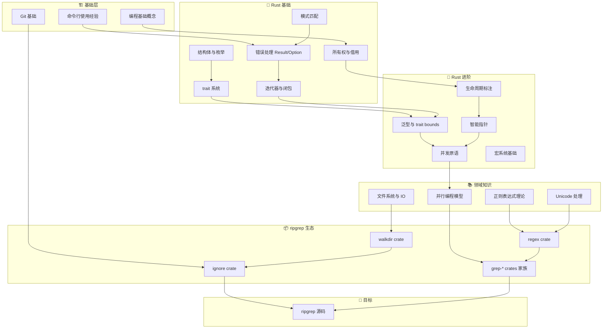

# ripgrep 源码学习路径

## 1. 前置知识清单（地基检查）

| 层级 | 知识领域 | 重要度 | 自检问题 |
|------|---------|--------|----------|
| L1 | Rust 基础语法 | ⭐⭐⭐⭐⭐ | 能否独立写出 500 行的 Rust CLI 工具？ |
| L2 | Rust 所有权系统 | ⭐⭐⭐⭐⭐ | 能否解释 `&str` vs `String` 在函数参数中的选择？ |
| L3 | Rust 并发编程 | ⭐⭐⭐⭐ | 了解 `Arc<Mutex<T>>` 和 channel 吗？ |
| L4 | 正则表达式原理 | ⭐⭐⭐⭐ | 知道 NFA/DFA 区别吗？ |
| L5 | 文件系统/IO | ⭐⭐⭐ | 理解 mmap、缓冲 IO 吗？ |
| L6 | CLI 设计模式 | ⭐⭐⭐ | 用过 clap 或类似库吗？ |

---

## 2. 学习路径依赖图



---

## 3. 核心 20% 知识点（产生 80% 效果）

### 3.1 各大类的原子化问题

---

### 📘 A. Rust 基础（核心20%）

**关键主题：所有权、借用、错误处理、迭代器**

| # | 原子问题 | 为何重要 |
|---|---------|---------|
| 1 | `String` 和 `&str` 有什么区别？何时用哪个？ | ripgrep 大量处理字符串 |
| 2 | `move` 关键字在闭包中做了什么？ | 并行搜索用大量闭包 |
| 3 | `Vec<T>` 的所有权转移 vs 借用 `&[T]` 如何选择？ | 缓冲区传递核心模式 |
| 4 | `Result<T, E>` 的 `?` 操作符如何工作？ | 错误处理贯穿全库 |
| 5 | `Option<T>` 的 `map`、`and_then`、`unwrap_or` 区别？ | 链式处理无处不在 |
| 6 | 迭代器的 `map`、`filter`、`collect` 如何组合？ | 数据流处理核心 |
| 7 | `impl Trait` 和 `dyn Trait` 的区别？ | 抽象搜索器接口 |
| 8 | 如何为自定义类型实现 `Iterator` trait？ | 理解搜索结果迭代 |

---

### 📘 B. Rust 并发（核心20%）

**关键主题：Arc、Mutex、Channel、线程池**

| # | 原子问题 | 为何重要 |
|---|---------|---------|
| 1 | `Arc<T>` 解决什么问题？与 `Rc<T>` 区别？ | 共享配置跨线程 |
| 2 | `Mutex<T>` 的 `lock()` 返回什么？为何是 `Result`？ | 保护共享状态 |
| 3 | `mpsc::channel` 的发送端和接收端如何工作？ | 搜索结果汇聚 |
| 4 | `crossbeam_channel` 比标准库 channel 好在哪？ | ripgrep 实际使用 |
| 5 | `std::thread::spawn` 的生命周期约束是什么？ | 理解 `'static` 要求 |
| 6 | 什么是线程池？为何不为每个文件创建新线程？ | 性能核心 |

---

### 📘 C. 正则表达式原理（核心20%）

**关键主题：有限自动机、匹配算法**

| # | 原子问题 | 为何重要 |
|---|---------|---------|
| 1 | NFA 和 DFA 分别是什么？各有什么优缺点？ | regex crate 核心选择 |
| 2 | 为什么 `.*` 可能导致性能问题？ | 理解回溯 |
| 3 | 什么是"字面量优化"？ | ripgrep 快速的秘密 |
| 4 | `regex::Regex` vs `regex::bytes::Regex` 区别？ | 二进制文件搜索 |
| 5 | 什么是 SIMD 加速？如何用于字符串搜索？ | memchr 优化原理 |

---

### 📘 D. 文件系统与 IO（核心20%）

| # | 原子问题 | 为何重要 |
|---|---------|---------|
| 1 | `BufReader` 比直接 `read` 好在哪？ | IO 性能关键 |
| 2 | 什么是内存映射（mmap）？何时使用？ | 大文件搜索策略 |
| 3 | `walkdir` 如何遍历目录？深度优先还是广度优先？ | 文件发现机制 |
| 4 | `.gitignore` 规则匹配的复杂性在哪？ | ignore crate 存在意义 |
| 5 | 什么是符号链接？如何处理循环链接？ | 目录遍历陷阱 |

---

### 📘 E. ripgrep 架构（核心20%）

| # | 原子问题 | 为何重要 |
|---|---------|---------|
| 1 | ripgrep 的 crate 分层结构是什么？ | 理解模块职责 |
| 2 | `grep-searcher` 的 `Searcher` 做了什么抽象？ | 搜索核心 |
| 3 | `grep-printer` 如何将结果格式化输出？ | 输出系统 |
| 4 | 搜索是如何并行化的？按文件还是按行？ | 并行策略 |
| 5 | `--type` 过滤是在哪个阶段实现的？ | 过滤管道 |

---

### 3.2 可跳过的 80% 枝节

```
📂 Rust 基础
├── ✅ 核心: 所有权、借用、迭代器、错误处理
└── ⏭️ 可跳过:
    ├── 高级宏编程（过程宏实现细节）
    ├── unsafe 的深入细节（ripgrep 很少用）
    ├── async/await（ripgrep 用同步 IO）
    └── FFI 与 C 互操作

📂 正则表达式
├── ✅ 核心: NFA/DFA 概念、字面量优化
└── ⏭️ 可跳过:
    ├── 正则引擎完整实现细节
    ├── Thompson 构造法的数学证明
    ├── Unicode 规范的完整细节
    └── PCRE 特性（ripgrep 不支持的功能）

📂 文件系统
├── ✅ 核心: 缓冲IO、目录遍历、gitignore
└── ⏭️ 可跳过:
    ├── 各操作系统文件系统实现差异
    ├── inotify/fswatch 文件监控
    ├── 硬链接的深入处理
    └── 文件锁机制

📂 并发
├── ✅ 核心: Arc、Mutex、Channel、线程池概念
└── ⏭️ 可跳过:
    ├── 无锁数据结构实现
    ├── 内存序（Memory Ordering）深入
    ├── 条件变量高级用法
    └── 协程/绿色线程

📂 ripgrep 源码
├── ✅ 核心: grep-searcher、grep-printer、ignore
└── ⏭️ 可跳过:
    ├── Windows 特定代码路径
    ├── 完整的 CLI 参数解析（几百个选项）
    ├── 基准测试代码
    └── CI/CD 配置
```

---

## 4. 推荐学习路线（实操）

```
第1周: Rust 基础巩固
├── 完成 Rustlings 练习
├── 写一个简单的 cat 命令
└── 写一个简单的 grep（单文件、固定字符串）

第2周: 依赖库熟悉
├── 阅读 regex crate 文档，写 10 个例子
├── 阅读 walkdir 文档，遍历目录统计文件
└── 阅读 ignore crate 文档，实现 gitignore 过滤

第3周: ripgrep 架构
├── 运行 rg 各种命令，观察输出
├── 阅读 GUIDE.md 和 ARCHITECTURE.md
└── 画出模块依赖图

第4周+: 源码阅读
├── 从 main.rs 入口开始
├── 追踪一次简单搜索的完整路径
├── 理解并行搜索实现
└── 阅读性能关键路径代码
```

---

需要我展开其中任何一个部分吗？比如详细解释某个原子问题，或深入分析 ripgrep 的某个模块？